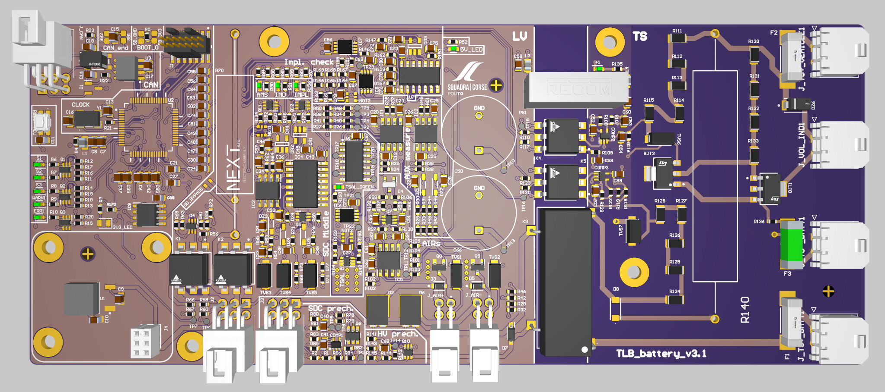

# TSAL Latch Board - Battery Side - Firmware
This repo contains the firmware and bootloader for the SensorBoard Device v3.1



## Develop
**PLEASE STOP USING CRLF LINE ENDING : use LF as normal people do**

Git can handle this for you correctly!

If you want it configured for this project only use `--local` otherwise for your whole system use `--global`.

- On windows: `git config --local core.autocrlf=true`
- On Linux/OSX: `git config --local core.autocrlf=input`

Checkout out either [this](https://www.git-scm.com/book/en/v2/Customizing-Git-Git-Configuration#_formatting_and_whitespace) or [this](https://stackoverflow.com/a/46347609/9167660) for more information.

Don't use `.gitattributes` it gets messy very quickly.

## Dependencies
- `arm-none-eabi-gdb`, `arm-none-eabi-gcc`, `arm-none-eabi-newlib`,`arm-none-eabi-binutils`: ARM toolchain necessary to compile and debug the firmware
- `make`: or similar
- `openocd`: to flash the firmware on the target via a debug probe (STLINK)
- `bootcommander`, `libopenblt`: to flash the firmware via can-bus

## Build
If all the software dependencies are available through `$PATH`
```bash
make
```
otherwise specify them via:
```bash
make GCC_PATH=/<path_to_compiler>
```
This will build the firmware to be flashed via `openocd` and a debug probe (STLINK)
## Build Bootloader
All software dependencies must be available in `$PATH`
```bash
cd ./openblt_f446re
make
cd ..
```
This will build the Bootloader firmware to be flashed via `openocd` and a debug probe (STLINK)

## Flash 
Two approaches for flashing:
- Baremetal no bootloader
- Bootloader + flash via can
### Baremetal no bootloader
Make sure the debug probe is attached to the target and they see each other. 
To verify this run this command from the project rootdir:
```bash
openocd -f openocd.cfg
```
It should look something like this:
```bash
TODO add openocd status
```

Make sure you have `openocd` dependency in `$PATH`.
```bash
make flash
```
otherwise specify the path via:
```bash
make flash OPENOCD_PATH=/<openocd_path>
```
### Bootloader + flash via can
First flash the bootloader on the device (all dependencies must be in `$PATH`, the debugger probe must be able to talk to the target see )
```bash
cd ./openblt_f446re
make flash
cd ..
```
Then connect the sensorboard device on a CAN bus network where you can send and receive data.
```bash
make can_flash
```
If `bootcommander` dependency is not in `$PATH` specify it like this:
```bash
make can_flash BOOTCOMMANDER_PATH=/<path_to_bootcomamnder_dir>
```

